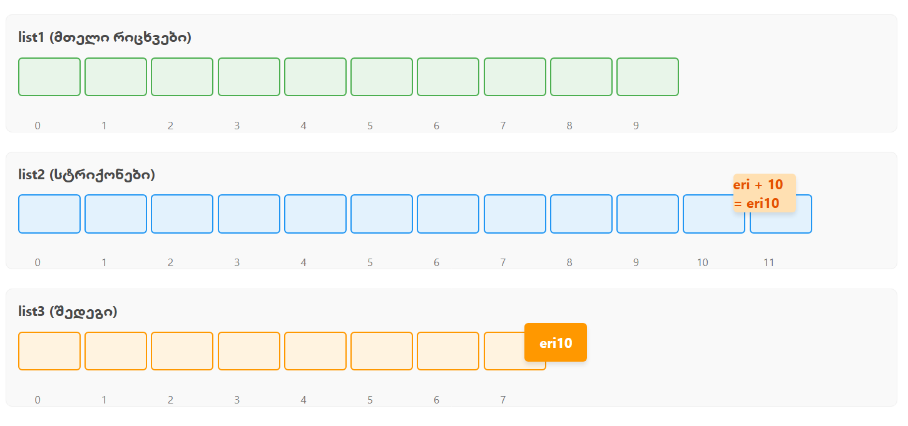

# ListManager Program - Final Exam Task 1


## Overview
This Java program processes two predefined lists (`list1` and `list2`) to generate a third list (`list3`) based on specific indexing rules. It demonstrates:
- List operations (combining, pruning)
- Error handling for out-of-bounds indices
- Dynamic processing for arbitrary input sizes

---

## Algorithm Explanation

### Step 1: Combining Lists
1. **Input:** 
   - `list1`: Integers (`[6, 1, 8, ...]`)
   - `list2`: Strings (`["axg", "djp", ...]`)
2. **Process:**
   - For each element `N` in `list1`:
     - Calculate index for `list2` as `N + 1`.
     - Fetch the string at that index from `list2`.
     - Combine with `N` (e.g., `"djp" + 1 → "djp1"`).
     - Add result to `list3`.
3. **Error Handling:** Skips invalid indices (see below).

### Step 2: Pruning List3
1. **Input:** `list3` (from Step 1)
2. **Process:**
   - Remove elements from `list3` where indices match values in `list1`.
   - Indices are processed in **descending order** to avoid shifting issues.

---

## Error Handling
The program handles two edge cases:
1. **Out-of-Bounds Access in `list2`:**
   - If `(N + 1) >= list2.size()`, skips the element and logs:
     ```
     Skipping element N at position i: index (N+1) is out of bounds for list2
     ```
   - *Example:* For `N=10` (last element in `list1`), `10+1=11` is invalid since `list2.size()=12` (indices 0-11). Thus, `list2.get(11)` succeeds, but `list2.get(12)` would fail.

2. **Invalid Indices for Pruning:**
   - Values in `list1` that are negative or exceed `list3.size()` are ignored during pruning.

---
## Screenshot



## Input/Output Examples

### Example: Valid Input
**Input:**
```java
list1 = [6, 1, 8, 7, 3, 5, 9, 10, 4, 2]
list2 = ["axg", "djp", "wge", "knr", "ceh", "idc", "czu", "lvm", "cqh", "znm", "esf", "eri"]
**Output:**
List1: [6, 1, 8, 7, 3, 5, 9, 10, 4, 2]
List2: [axg, djp, wge, knr, ceh, idc, czu, lvm, cqh, znm, esf, eri]
Skipping element 10 at position 7: index 11 is out of bounds for list2
List3 after Step 1: [lvm6, djp1, znm8, cqh7, knr3, idc5, eri9, ceh4, wge2]
Final List3: [lvm6,]