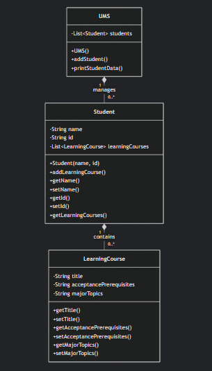

# University Management System (UMS) - Final Exam Task 2


## Overview
A Java program that manages student data and their learning courses in a university system. It demonstrates:
- Object-oriented principles (encapsulation, composition)
- List management
- Special case handling (for the student "Elizaveta Darsalia")

**Package:** `OOP.FinalExam.t2`  
**Main Class:** `UMS.java`

---

## Class Structure

### 1. `LearningCourse` Class
| Field                     | Type   | Description                          |
|---------------------------|--------|--------------------------------------|
| `title`                   | String | Name of the course                   |
| `acceptancePrerequisites` | String | Required prerequisites for the course|
| `majorTopics`             | String | Key topics covered in the course     |

**Methods:**
- Standard getters/setters for all fields

### 2. `Student` Class
| Field               | Type                  | Description                     |
|---------------------|-----------------------|---------------------------------|
| `name`              | String                | Student's full name             |
| `id`                | String                | Student ID number               |
| `learningCourses`   | `List<LearningCourse>`| Courses enrolled by the student |

**Methods:**
- `addLearningCourse()`: Adds a course to the student's list
- Standard getters/setters for all fields

### 3. `UMS` Class (Main System)
| Field        | Type            | Description               |
|--------------|-----------------|---------------------------|
| `students`   | `List<Student>` | List of all students      |

**Key Methods:**
- `addStudent()`: Registers a new student
- `printStudentData()`: Displays student info and their courses
- Special handling for student "Elizaveta Darsalia"

---

## Key Features
1. **Dynamic Course Management**:
   - Students can be added with any number of courses
   - Courses can be modified via setters

2. **Special Case Handling**:
   - Auto-populates courses when the student is "Elizaveta Darsalia" (ID: 198376490)
   - Uses exact string matching (case-sensitive)

3. **Error Resilience**:
   - Handles empty course lists gracefully
   - Clear separation of data and presentation logic

---

## How It Works
1. **Initialization**:
   ```java
   UMS ums = new UMS();
   Student me = new Student("Elizaveta Darsalia", "198376490");
   ums.addStudent(me);Course Assignment:

2. **For the specific student, 5 courses are auto-added:**
 
 - 1.Object Oriented Programming
 - 2.Calculus II
 - 3.Computer Organization
 - 4.Mathematical Foundation of Computing
 - 5.English Language Course C1-2
 
3. **Data Printing:**
 - ums.printStudentData(me); // Prints student + course details

## UML Diagram

